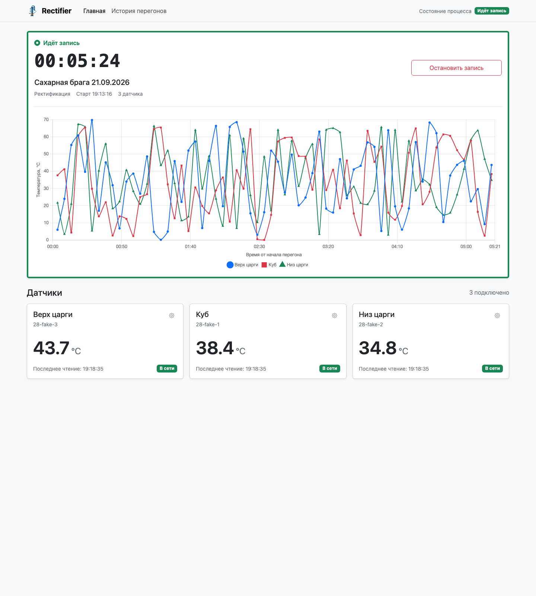

# Rectifier

Домашний локальный сервис для мониторинга температур и ведения журнала
ректификационной колонны на Raspberry Pi 5.

> Проект находится на раннем этапе разработки. Кнопки Start/Stop управляют
> только записью измерений — не ТЭНом, клапанами, отбором или физическим
> процессом.



Сейчас Rectifier умеет читать несколько DS18B20, переименовывать датчики,
создавать партии, запускать и останавливать Run, сохранять измерения и показывать
графики активных и завершённых записей, добавлять на них ручные метки и
показывать настроенный MJPEG-поток в отдельной вкладке и полноэкранном просмотре. История группирует перегоны по
партиям, а активный Run восстанавливается после перезапуска. Hardware automation
ещё не реализована.

## Попробовать без железа

Нужен Go 1.26.4:

```bash
git clone https://github.com/IlyaBikmeev/rectifier.git
cd rectifier
go run ./cmd/rectifier
```

Откройте `http://localhost:8080`. Fake-режим с тремя датчиками включён по
умолчанию. Подробности — в [руководстве разработчика](docs/development.md).
Для проверки с uStreamer запустите:

```bash
go run ./cmd/rectifier -camera-url=http://rectifier-test.local:8081/stream
```

Адрес потока должен открываться из браузера пользователя. Браузер может
заблокировать HTTP-поток, если сам UI открыт по HTTPS.

## Установить на Raspberry Pi

Для Raspberry Pi 5 с Raspberry Pi OS Lite 64-bit и DS18B20 выполните:

```bash
curl -fsSL https://github.com/IlyaBikmeev/rectifier/releases/latest/download/install-release.sh | sh
```

Установщик скачает последний ARM64-релиз, проверит SHA256 и запросит `sudo`
только для системной установки. Go и `jq` на устройстве не нужны. Подключение
GPIO, ручная установка и модель доверия описаны в
[инструкции по установке](docs/install.md).

- UI: `http://<имя-raspberry>.local:8080`
- Метрики: `http://<имя-raspberry>.local:8080/metrics`
- Партии, Runs и измерения хранятся локально в SQLite.
- UI и запись работают автономно без интернета.

См. также [использование](docs/usage.md),
[эксплуатацию и диагностику](docs/operations.md) и
[план MVP](docs/mvp-plan.MD).

## Безопасность

В HTTP-сервисе нет авторизации и TLS: не публикуйте порт `8080` напрямую в
интернет. Ограничьте доступ доверенной локальной сетью.

Ректификационное оборудование связано с высокой температурой, электричеством и
горючими парами. Rectifier не является системой аварийной защиты. Используйте
подходящие защитные устройства, вентиляцию и проверенное оборудование; не
оставляйте работающую установку без наблюдения.
